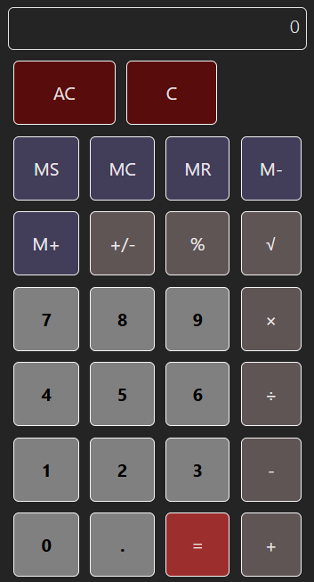

# React + Vite


This project is a React-based calculator application built with Vite, offering a modern and efficient development experience. It includes configurations for ESLint and Hot Module Replacement (HMR).



## Development with Docker

This project supports a Dockerized development environment for ease of setup and consistency.

### Prerequisites

- Docker and Docker Compose installed
- Git

### Getting Started

1. **Clone the repository**:
    ```bash
    git clone https://github.com/JBB0807/ReactCalculatorJB.git
    cd ReactCalculatorJB
    ```

2. **Start the development container**:
    ```bash
    docker-compose up
    ```

3. **Access the application**:
    Open your browser and navigate to `http://localhost:5173`.

## GitHub Actions Workflow

This project includes a GitHub Actions workflow for CI/CD automation. The status of the workflow is displayed via the badge above.

### Setting Up GitHub Actions

1. Ensure the `deploy.yml` file in `.github/workflows` is configured for your project.
2. Replace `JBB0807` and `ReactCalculatorJB` in the badge URL with your GitHub username and repository name:
    ```markdown
    
    ```

### Customization

You can modify the configuration files (`vite.config.js`, `.eslintrc.js`) to suit your project's needs.

## Troubleshooting

- **Docker Issues**: Ensure Docker is running and properly configured.
- **Build Errors**: Verify all dependencies are installed correctly.
- **Workflow Failures**: Check the GitHub Actions logs for detailed error messages.
- **Path Problems**: Confirm that the base path in `vite.config.js` matches your repository name.
